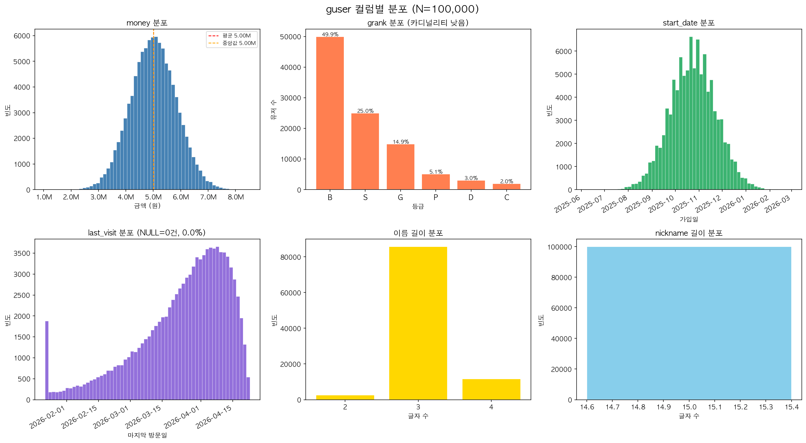

# MySQL 인덱스 성능 실험

guser(200만 건) + trade(1000만 건) 기준으로 인덱스 유무에 따른 쿼리 성능 차이를 측정한다.

---

## 0. Python 환경 설정 (최초 1회)

macOS Homebrew Python은 시스템 보호 정책(PEP 668)으로 직접 pip 설치가 불가하므로 venv를 사용한다.

```bash
python3 -m venv .venv
source .venv/bin/activate
pip install -r requirements.txt
```

이후 작업 시 매번 venv 활성화 필요:

```bash
source .venv/bin/activate   # 활성화
deactivate                  # 종료
```

---

## 1. 환경 시작

```bash
docker-compose up -d
```

---

## 2. 데이터 생성

```bash
python3 gen-user.py 2000000
python3 gen-trade.py 10000000   # guser.csv 행수를 자동으로 읽어 유저 수로 사용

# csv_files/ 디렉토리에 자동 저장됨 (Docker 볼륨 마운트 경로)
```

---

## 3. 스키마 생성 및 데이터 삽입

```bash
docker exec -i mydb mysql -u honux -pbandi1004 honuxdb --local-infile=1 --default-character-set=utf8mb4 < schema.sql
docker exec -i mydb mysql -u honux -pbandi1004 honuxdb --local-infile=1 --default-character-set=utf8mb4 < insert.sql
```

삽입 완료 확인:

```sql
SELECT COUNT(*) FROM guser;   -- 2,000,000
SELECT COUNT(*) FROM trade;   -- 10,000,000
```

---

## 4. 인덱스 없는 상태에서 성능 측정

MySQL 접속:

```bash
docker exec -it mydb mysql -u honux -pbandi1004 honuxdb --default-character-set=utf8mb4
```

hash join 비활성화 (JOIN 쿼리도 느리게 만들기 위해):

```sql
SET optimizer_switch='hash_join=off';
```

`benchmark.sql`의 쿼리를 실행하며 `actual time` 기록.  
EXPLAIN ANALYZE 결과에서 확인할 항목:

| 항목 | 인덱스 없을 때 | 인덱스 있을 때 |
|------|--------------|--------------|
| `type` | `ALL` (풀스캔) | `range` / `ref` |
| `rows` | 전체 행 수 | 소수 행 |
| `actual time` | 수 초 | 수 밀리초 |

---

## 5. 인덱스 추가

```sql
-- 단일 인덱스
ALTER TABLE guser ADD INDEX idx_grank (grank);
ALTER TABLE guser ADD INDEX idx_money (money);
ALTER TABLE guser ADD INDEX idx_start_date (start_date);
ALTER TABLE guser ADD INDEX idx_last_visit (last_visit);
ALTER TABLE trade ADD INDEX idx_seller (seller);
ALTER TABLE trade ADD INDEX idx_price (price);
ALTER TABLE trade ADD INDEX idx_trade_date (trade_date);

-- 복합 인덱스 (추가 실험용)
ALTER TABLE guser ADD INDEX idx_rank_money (grank, money);
ALTER TABLE trade ADD INDEX idx_seller_date (seller, trade_date);
```

---

## 6. 인덱스 추가 후 성능 재측정

동일한 `benchmark.sql` 쿼리를 다시 실행해 결과 비교.  
hash join도 복원해서 비교:

```sql
SET optimizer_switch='hash_join=on';
```

---

## 7. 인덱스 제거 (초기화)

```sql
ALTER TABLE guser DROP INDEX idx_grank;
ALTER TABLE guser DROP INDEX idx_money;
ALTER TABLE guser DROP INDEX idx_start_date;
ALTER TABLE guser DROP INDEX idx_last_visit;
ALTER TABLE trade DROP INDEX idx_seller;
ALTER TABLE trade DROP INDEX idx_price;
ALTER TABLE trade DROP INDEX idx_trade_date;
ALTER TABLE guser DROP INDEX idx_rank_money;
ALTER TABLE trade DROP INDEX idx_seller_date;
```

---

## 주요 파일

| 파일 | 설명 |
|------|------|
| `schema.sql` | 테이블 생성 |
| `gen-user.py` | guser CSV 생성 |
| `gen-trade.py` | trade CSV 생성 |
| `insert.sql` | LOAD DATA로 CSV 삽입 |
| `benchmark.sql` | 인덱스 전후 성능 측정 쿼리 |
| `tip.md` | Bulk insert 성능 팁 |

---

## 샘플 데이터 분포

아래 그래프는 `userdataCheckV3.ipynb`에서 N=100,000 샘플로 생성한 컬럼별 분포다.



| 컬럼 | 분포 특성 |
|------|----------|
| `money` | 정규분포 (평균 500만, std 83만) |
| `grank` | B 50% → S 25% → G 15% → P 5% → D 3% → C 2% |
| `start_date` | 균등분포 |
| `last_visit` | 감마분포 (최근일수록 빈도 높음) |
| `name` | 한글 성씨 빈도 가중치 적용, 복성 포함 |
| `nickname` | 고유값 100% |

---

## 데이터 생성 방식에 대해

`namae.py`, `ninckname.py`, `amoosoo.py`는 외부 라이브러리(Faker 등) 대신 직접 작성한 함수를 사용한다.

이유는 이 실험의 핵심이 **분포 제어**에 있기 때문이다. `money`의 정규분포, `last_visit`의 감마분포(최근 접속일수록 빈도 높음), `grank`의 확률 가중치(B 50%, S 25%, ...)는 인덱스 효과를 측정하기 위해 의도적으로 설계된 값이다. Faker 같은 범용 라이브러리는 이런 세밀한 분포 조정을 지원하지 않는다.

한글 이름(`namae.py`)도 마찬가지로, 성씨 빈도 가중치와 복성 포함 여부를 직접 제어하기 위해 커스텀으로 유지한다.
